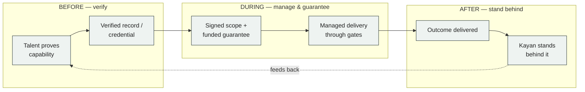
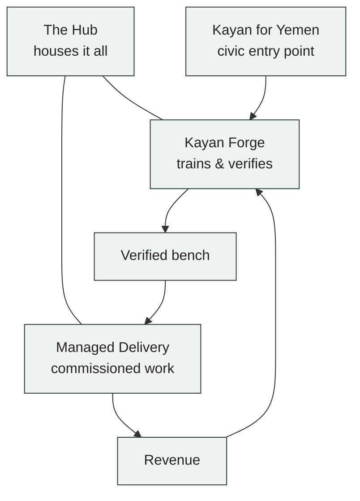

# كِيان — السردية المرجعية
### المرجع الأساسي الذي تتفرّع منه كل وثيقة في المؤسسة
**الطبقة:** سردية مؤسِّسة · **الحالة:** مكتملة (CORE-01) · **النسخة:** v[token] · **اللغة:** عربية أصيلة (تليها الطبعة الإنجليزية الأصيلة)
**القاعدة المرجعية:** يخضع كل ما يلي لميثاق التشغيل الرئيس لكِيان. لا اسم شخص، ولا رقم، ولا تاريخ مثبَّت هنا؛ القيم كلها رموز تُحَل مرة واحدة في نهايتها.

> **«الموهبة كانت هنا دائمًا. النظام لم يكن.»**

---

## أولًا · من المؤسس

اليمن لم يفتقر يومًا إلى الموهبة. ما افتقر إليه هو الطبقة المؤسسية التي تضع الموهبة في العمل وفق معيار يعترف به العالم.

طوال أكثر من عشر سنوات، رأيت مهنيين يمنيين استثنائيين — مصممين، ومهندسين، وكُتّابًا، ومترجمين، واستوديوهات صغيرة — يُنتجون عملًا تدفع مقابله أي سوق في الدنيا. غير أن العمل كان يبقى غير مرئي، أو يُسعَّر بأقل من قيمته، أو لا يصل إلى صاحبه أصلًا. لم تكن العلة يومًا في الموهبة. كانت في غياب شركة جادّة تقف بين الموهبة والعالم، تتعاقد باسمها، وتضمن وصولها.

كِيان هي الشركة التي بنيناها لسدّ هذه الفجوة. مؤسسة يمنية، تأسست في عدن، تفتح أبوابها للعملاء والأعضاء والجمهور. نحن هنا بدوام كامل، وجئنا لنبقى. نكلّف العمل ونقف خلفه.

---

## ثانيًا · ما هو كِيان

كِيان مؤسسة واحدة تؤدي ثلاثة أدوار في زمن واحد:
**تتحقّق من الناس قبل العمل، وتدير الإنجاز وتضمنه أثناءه، وتقف خلف النتيجة بعده.**

هذا التعريف، في سطر، هو كل ما تحتاج معرفته عن كِيان. ليست سوقًا إلكترونية تعرض أسماء وتترك العميل وحده أمام المخاطرة. وليست مساحة عمل تؤجّر مكاتب. وليست منصة. كِيان **بنية ثقة**: نظام، ومجتمع، ومعيار. هي الطبقة التي تحوّل القدرة الفردية إلى نتيجة يمكن التعاقد عليها، ومحاسبتها، والوثوق بها.

نسمّي ذلك **الخريطة الموثَّقة للكفاءات**: لا قائمة وعود، بل سجلّ مَن أثبت، وما أنجز، وإلى أي حدٍّ يُعتمد عليه.

---

## ثالثًا · أين نقف — المشكلة التي وُجِدنا لها

السوق العالمية للخدمات المهنية تُقاس بالتريليونات سنويًا. لا يصل اليمن منها إلا كسرٌ من واحد في المئة. السبب ليس نقص القدرة، بل غياب البنية التي تتيح لتلك القدرة أن تُرى، ويُتعاقَد عليها، وتُدفَع.

أربعة إخفاقات مزمنة تفسّر الفجوة، وهي حاضرة في كل منصّة عمل حر، وكل ترتيب غير رسمي، وكل برنامج حسن النية حاول الوصل بين الموهبة اليمنية والعمل الدولي. كِيان مبنية لتُجيب عنها في مؤسسة واحدة بدل أربع محاولاتٍ متناثرة:

1. **ضجيج الملفّات.** المنصّات تكافئ الوصف العريض على حساب الدليل المحدّد. ملفٌّ يدّعي عشر سنوات خبرة لا يُميَّز عن ملفٍّ لا خبرة وراءه. فيضيع العميل في الغربلة، ويصل إلى قرار التكليف وهو يكاد لا يرى.
2. **اختلال الثقة.** حتى بعد الدفع، تبقى ثقة العميل معلّقة على ادّعاءٍ في ملف. لا تحقّق مستقل، ولا طرف محايد، ولا مساءلة نافذة إن أخفق العمل.
3. **عبء الإدارة.** دفع العميل مقابل نتيجة، فتسلّم وصولًا إلى شخص. صارت المتابعة والتذكير والمراجعة عمله هو — وهو العبء نفسه الذي جاء التكليف ليرفعه عنه.
4. **هشاشة الفريق.** العمل الجادّ متعدّد التخصصات بطبيعته. تترك المنصّات أمر التكامل للعميل، فتأتي النتيجة متفاوتة، وتسقط التبعات على كلمة المهني في مواجهة كلمة العميل.

> الفجوة ليست في الموهبة. هي في غياب بنية التحقّق والإدارة والضمان بين الموهبة والسوق. تلك البنية هي ما بنيناه.

---

## رابعًا · القاعدة المؤسِّسة

تقوم كِيان على قاعدة تشغيلٍ واحدة لا تُكسَر:
**لا نطاق عملٍ موقَّع، ولا ضمان ماليٌّ مموَّل — لا يبدأ العمل.**

ليست هذه سياسة، بل هي معمار المؤسسة نفسه. القاعدة نفسها تحمي العميل والموهبة في آن: العميل لا يدفع في الفراغ، والموهبة لا تعمل دون ضمان. وما دامت الأموال محجوزة لدى كِيان وصيًّا محايدًا حتى تُستحَق، فإن الثقة تتحوّل من وعدٍ إلى بنية.

---

## خامسًا · كيف يعمل كِيان

كِيان وكيلٌ محايد، لا وسيط سلبي. نتعاقد باسم المؤسسة، ونحتفظ بالضمان المالي وصاية، ونقف خلف ما يصل إلى باب العميل. أجرنا حصةٌ صافية على الإنجاز، لا عمولة على الإحالة.

ينتظم العمل في **ثلاثة خطوط، يجمعها ميثاق واحد ومعيار واحد، ويعبرها ذراعٌ مدني واحد**:

- **التسليم المُدار** — المحرّك. نكلَّف بالعمل المهني ونسلّمه: من التصميم والبرمجة والمحتوى والترجمة إلى البحث والتدريب والاستشارة المنتقاة. خلف كل تكليف فريقٌ موثَّق لا يجمعه العميل بنفسه؛ يكلِّف كِيان، فنسلّم النتيجة.
- **المركز (الـ Hub)** — الأرضية العاملة: مكاتب بالساعة والشهر والسنة، وقاعات، ومساحة عملٍ عميق، ومقهى ضِمنها بابًا تدخل منه المدينة وتلتقي كِيان دون موعد. المقهى مرفقٌ داخل المركز، لا عملًا قائمًا بذاته.
- **مَصْنَع كِيان (Forge)** — المحرّك البشري: برامج قصيرة جادّة تُبنى على منهجٍ مكتوب ومعيار تقييمٍ مكتوب، تؤهّل خرّيجها لسجلٍّ معتمد، وحيث يصحّ، لمقعدٍ على منصّة التسليم.

ويعبر الخطوطَ الثلاثة **كِيان لليمن** — الذراع المدني الذي يمنح اليمنيين الشباب أول تجربةٍ معتمدة لعملٍ منظَّم، ويغذّي بنك الكفاءات الذي توظّف منه المؤسسة في السنوات المقبلة.

يربط هذا كلَّه **اعتماد كِيان**: الوثيقة التي يقرؤها العميل الدولي حين يسأل عن شخصٍ بعينه: مَن هو، وما الذي أنجزه فعلًا. وتدور الحلقة: المَصْنَع يغذّي البنك، والبنك يسلّم العمل، والعمل يموّل المَصْنَع، والمركز يؤوي الجميع، والذراع المدني هو مدخل كفاءات الغد.

---

## سادسًا · لماذا اليمن، ولماذا الآن

في 2026، الاقتصاد اليمني هشّ ومنقسم، وعدن مركز المنطقة المعترَف بها وعاصمتها المصرفية بعد انتقال المصارف إليها تحت رقابةٍ مشدّدة على الامتثال ومعرفة العميل. في بيئةٍ كهذه، **الثقة هي المنتَج**، والمؤسسة التي تتعامل بالقنوات الرسمية وتضمن الإنجاز تملك ما يندر: مصداقية يمكن التعاقد عليها.

وفي الوقت نفسه، تراجع تمويل الإغاثة تراجعًا حادًّا، وصار على كل ريال أن يثبت أثره. والمنظومة مزدحمة ببرامج **التدريب والتأهيل**، لكنها تفتقر إلى **سكّة التسليم الموثَّق** التي تحوّل الشاب المُدرَّب إلى عملٍ مدفوعٍ خاضع للمساءلة. تلك السكّة بالضبط هي موقع كِيان: لا برنامج تدريبٍ آخر، بل البنية التي تأتي بعد المنحة، وتحوّل المهارة إلى نتيجة.

هذه ليست لحظةً نؤجّل فيها البناء. هي اللحظة التي يصبح فيها هذا البناء ضرورة.

---

## سابعًا · لمن نعمل

- **للموهبة:** طريقٌ من الإثبات إلى الاعتماد إلى عملٍ حقيقيٍّ مدفوع — لا عرضٌ في قائمة، بل سجلٌّ يُحتسب.
- **للعملاء والممولين:** نتيجةٌ مضمونة بنطاقٍ مكتوب ومعيارٍ وضمانٍ مالي — يكلِّفون مرة، ويتسلّمون عملًا، لا عبء إدارة.
- **للمجتمع:** بابٌ تدخل منه المدينة، ومكانٌ يلتقي فيه من لم يكن ليلتقي، ومعيارٌ للعمل العام يُرفع به سقف ما يُتوقَّع.
- **للشركاء:** مؤسسةٌ محلية موثوقة تصلح شريكًا منفِّذًا، تفتح القناة وتقف خلف التنفيذ.
- **للجهات الحكومية:** قدرةٌ منظَّمة، شفافة، خاضعة للمساءلة، تخدم أولويات التشغيل والتنمية بلا ادّعاء.

---

## ثامنًا · صوت كِيان

نتكلّم كما نعمل: بهدوءٍ وثقة. جُمَلٌ مباشرة، وأفعالٌ تحمل مسؤولية — **نكلِّف، نسلّم، نضمن، نقف خلف**. لا مبالغة، ولا لغة تسويقٍ جوفاء، ولا مصطلحٌ داخلي في وجه الجمهور؛ نعبّر عن الحقيقة الإنسانية بلغةٍ بسيطة. كل ما يصدر عن كِيان يقرأ كأنه كُتب مرة واحدة، في صيغته النهائية، بلا أثرٍ لمسوّدة.

---

## تاسعًا · الوعد

ما نقوله، نقف خلفه. وما يصل، نضع اسمنا عليه.

> ### «خلفَ كلِّ إنجازٍ، كِيان»

---
---

# KAYAN — The Canonical Narrative
### The reference every other document inherits from
**Layer:** founding narrative · **Status:** complete (CORE-01) · **Version:** v[token] · **Language:** English-native edition (companion to the Arabic lead)

> **"The talent was always here. The system was not."**

---

## I · From the Founder

Yemen has never lacked talent. It has lacked the institutional layer that puts talent to work to a standard the world recognises.

For more than a decade I watched extraordinary Yemeni professionals — designers, engineers, writers, translators, small studios — produce work any market in the world would pay for. The work stayed invisible, mispriced, or never reached its client. The problem was never the talent. It was the absence of a credible company standing between the talent and the world — one that would contract in its own name and stand behind what it delivered.

Kayan is the company we built to close that gap. A Yemeni institution, founded in Aden. We are here full-time, and we are here to stay. We commission work and we stand behind it.

---

## II · What Kayan Is

Kayan is one institution doing three things in a single arc:
**it verifies people before the work, manages and guarantees delivery during it, and stands behind the outcome after.**

That sentence is the whole of it. Kayan is not a marketplace that lists names and leaves the client alone with the risk. It is not a workspace that rents desks. It is not a platform. Kayan is **trust infrastructure** — a system, a community, and a standard. It is the layer that turns individual capability into an outcome that can be contracted, held accountable, and trusted.

We call it the **Verified Talent Map**: not a list of claims, but a record of who has proven what, and how far they can be relied on.

---

## III · Where We Stand — the problem we exist for

The global market for professional services is measured in trillions a year. A fraction of one percent reaches Yemen. The reason is not a shortage of capability. It is the absence of the infrastructure that lets capability be seen, contracted, and paid.

Four chronic failures explain the gap — present in every freelance platform, every informal arrangement, every well-meaning programme that has tried to bridge Yemeni talent to international work. Kayan answers them in one institution rather than four loose attempts:

1. **Profile noise.** Platforms reward broad self-description over specific evidence. A profile claiming ten years is indistinguishable from one with none. The client loses time to filtering and reaches the commissioning decision nearly blind.
2. **Asymmetric trust.** Even after payment, the client's confidence rests on a claim in a profile. No independent verification, no neutral arbiter, no enforceable accountability if the work fails.
3. **The management burden.** The client paid for an outcome and received access to a person. Following up, reminding, reviewing — the very burden the engagement was meant to remove — becomes the client's job.
4. **Team fragility.** Serious work is multi-disciplinary by nature. Platforms leave integration to the client; the result is uneven quality and disputes that fall on one person's word against another's.

> The gap is not in the talent. It is in the verification, management, and guarantee infrastructure between the talent and the market. That infrastructure is what we have built.

---

## IV · The Founding Rule

Kayan rests on one operating rule that is never broken:
**no signed scope of work and no funded guarantee — no work begins.**

This is not a policy; it is the architecture of the institution. The same rule protects the client and the talent at once: the client never pays into a void, and the talent never works without a guarantee. While funds are held by Kayan as a neutral fiduciary until earned, trust stops being a promise and becomes a structure.

---

## V · How Kayan Works

Kayan is a neutral agent, not a passive intermediary. We contract in the institution's name, hold the guarantee in fiduciary, and stand behind what reaches the client's door. Our fee is a net share of the delivered outcome, never a referral commission.

The work runs in **three lines, held by one charter and one standard, crossed by one civic arm**:

- **Managed Delivery** — the engine. We are commissioned and we deliver: design, software, content, translation, research, training, select advisory. Behind every engagement is a verified bench the client does not assemble themselves. They commission Kayan; we deliver the result.
- **The Hub** — the working floor: desks by the hour, month, or year; meeting rooms; deep-work space; and a café inside it as the front door through which the city meets Kayan without an appointment. The café is an amenity within the Hub, not a business of its own.
- **Kayan Forge** — the human engine: short, serious programmes built on a written curriculum and a written assessment standard, qualifying a graduate for a verified record and, where it fits, a place on the delivery bench.

Crossing all three is **Kayan for Yemen** — the civic arm that gives young Yemenis their first credentialled experience of structured work, and feeds the bench Kayan will hire from in the years ahead.

Binding it together is the **Kayan credential** — the document an international client reads when they ask, of one specific person: who is this, and what have they actually done. And the flywheel turns: Forge feeds the bench, the bench delivers the work, the work funds Forge, the Hub houses it all, and the civic arm is the entry point for the talent of tomorrow.

---

## VI · Why Yemen, Why Now

In 2026 the Yemeni economy is fragile and split, and Aden is the centre of the recognised zone — its banking capital since the banks relocated there under heightened compliance and know-your-customer scrutiny. In an environment like this, **trust is the product**, and an institution that works through formal channels and guarantees delivery holds what is rare: credibility that can be contracted.

At the same time, humanitarian funding has fallen sharply, and every dollar now has to prove its effect. The ecosystem is crowded with **training** programmes but missing the **verified-delivery rail** that turns a trained young person into paid, accountable work. That rail is exactly where Kayan sits: not another training programme, but the infrastructure that comes after the grant and turns skill into outcome.

This is not a moment to defer the build. It is the moment that makes the build necessary.

---

## VII · Who We Serve

- **Talent:** a path from proof to credential to real paid work — not a listing, but a record that counts.
- **Clients and funders:** a guaranteed outcome under a written scope, standard, and guarantee — commission once, receive work, carry no management burden.
- **Community:** a door the city walks through, a place where people who would not otherwise meet do, and a standard for public work that raises what is expected.
- **Partners:** a credible local institution fit to be a delivery partner — opening the channel and standing behind execution.
- **Government:** organised, transparent, accountable capacity serving employment and development priorities without overclaim.

---

## VIII · The Voice of Kayan

We speak the way we work: quietly, with confidence. Direct sentences and verbs that carry responsibility — **we commission, we deliver, we guarantee, we stand behind.** No hype, no hollow marketing language, no internal jargon facing the public; we express the human reality in plain words. Everything Kayan issues reads as written once, in final form, with no trace of a draft.

---

## IX · The Promise

What we say, we stand behind. What arrives, we put our name on.

> ### "Behind every outcome, a Kayan."

---

## Appendix — The trust arc (structural diagram)

---
*Canonical narrative — the spine. Architecture shown is provisional pending ratification of the single open fork (3 lines + civic arm). No contested value is hardcoded; all live in the Token Dictionary. Authored fresh from the corpus and our conversations; nothing carried as-is.*
